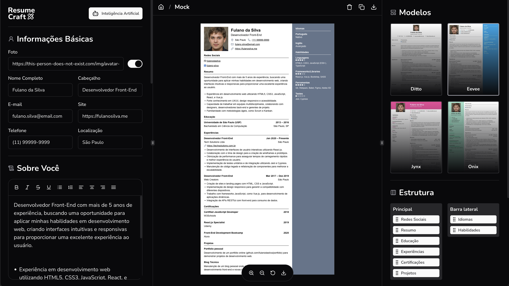

# Projeto Resume Craft

## 💻 _resumeCraft_

Um criador de currículos que simplifica o processo de criar, atualizar e compartilhar seu currículo.

## 💻 Projeto desenvolvido

## 💡 Info

O projeto está disponível em vários idiomas e vem repleto de recursos, como edição em tempo real, vários modelos, personalização por arrastar e soltar e integração com a OpenAI para aprimorar sua escrita.

## 🔨 Funcionalidades

- **Autenticação**: Implementação de um sistema de login e registro de usuários, utilizando Google ou Github.
- **Criação de Currículos com Editor em Tempo Real**: Ferramenta interativa para criar e personalizar currículos.
- **Armazenamento no Banco de Dados**: Salva os currículos criados pelos usuários em um banco de dados.
- **Geração de Conteúdo com Inteligência Artificial**: Utiliza AI para sugerir descrições e otimizar os currículos dos usuários.
- **Funcionalidades Premium com Compra via Stripe**: Oferece funcionalidades avançadas através de pagamentos online.
- **Geração de PDF com Componentes HTML**: Exporta currículos para PDF diretamente do editor, mantendo o layout impecável.

## 💻 Tecnologias/Pacotes utilizados

**Frontend**

- **Next.js 15** - Framework React para aplicações web modernas.
- **TypeScript** - Superset de JavaScript que adiciona tipagem estática.
- **Auth.js (NextAuth)** - Solução completa para autenticação.
- **shadcn/ui** - Componentes de interface reutilizáveis.
- **Tailwind CSS** - Framework de CSS utilitário para um design ágil e responsivo.
- **Drizzle ORM** - Ferramenta para gerenciar o banco de dados de forma simples e eficiente.
- **Puppeteer** - Biblioteca para automação de navegadores, usada na geração de PDFs.
- **Stripe** - Plataforma de pagamentos para implementar funcionalidades premium.
- **TanStack Query** - Gerenciamento de estados assíncronos e sincronização de dados.
- **React Hook Form** - Ferramenta para gerenciar formulários com facilidade.
- **OpenAI** - API para integrar inteligência artificial na geração de conteúdo.

## 👨‍💻 Autor

Gabriel Catarin, desenvolvedor web | Aveiro, Portugal

[ LinkedIn](https://www.linkedin.com/in/gabrieldiasdev/)
&nbsp;
